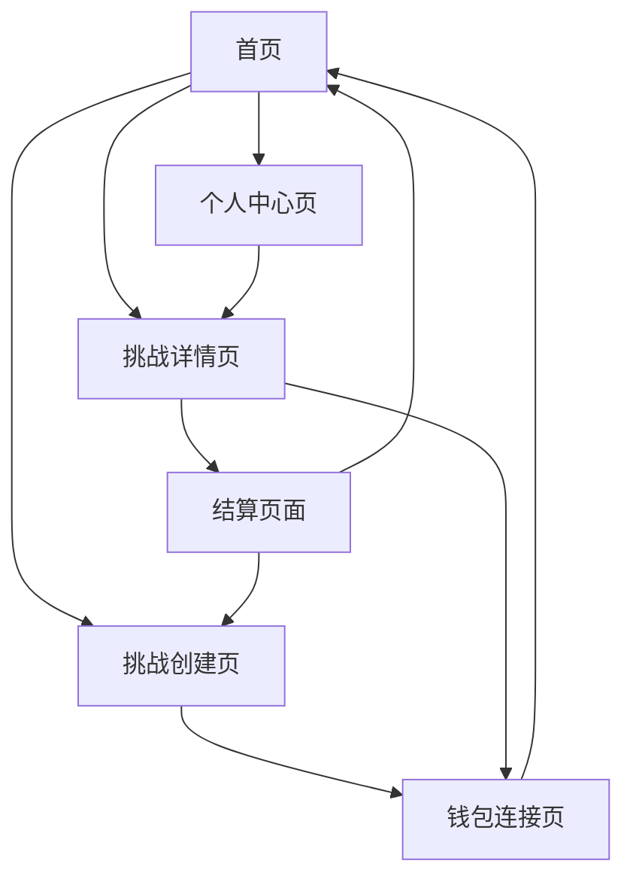

# Challenge Market 产品需求文档

## 1. 产品概述

Challenge Market 是一个基于 Solana 区块链的去中心化挑战市场平台，让任何人都能用一句话发起挑战，让任何人都能三步完成下注或接受挑战。
- 核心理念：将挑战、下注和社交互动结合，创造一个高频、低门槛的链上娱乐生态系统。
- 目标市场：面向年轻用户群体，提供类似 Polymarket 和 Pump.fun 的娱乐性投注体验，但专注于个人挑战和即时互动。

## 2. 核心功能

### 2.1 用户角色

| 角色 | 注册方式 | 核心权限 |
|------|----------|----------|
| 发起者（Creator） | SOL钱包连接 | 发起挑战，获得5%平台抽水分成，拥有挑战NFT |
| 接受者（Acceptor） | SOL钱包连接 | 接受挑战，上传证据，完成后获得奖池奖励 |
| 下注者（Bettor） | SOL钱包连接 | 对挑战结果进行押注，获得赔率收益 |
| 围观者（Amplifier） | SOL钱包连接 | 浏览、分享、传播挑战内容 |

### 2.2 功能模块

我们的Challenge Market需求包含以下主要页面：
1. **首页**：热门挑战展示、实时奖池排行、快速发起挑战入口
2. **挑战创建页**：一句话输入框、参数设置、一键发起功能
3. **挑战详情页**：挑战内容展示、实时下注、证据上传、倒计时显示
4. **钱包连接页**：SOL钱包连接、用户身份验证
5. **个人中心页**：我的挑战、下注记录、收益统计、NFT展示
6. **结算页面**：结果展示、奖励分配、分享功能

### 2.3 页面详情

| 页面名称 | 模块名称 | 功能描述 |
|----------|----------|----------|
| 首页 | 热门挑战卡片 | 展示进行中的热门挑战，显示奖池金额、剩余时间、参与人数 |
| 首页 | 实时排行榜 | 按奖池金额、热度、即将结束等维度排序展示挑战 |
| 首页 | 快速发起入口 | 醒目的"发起挑战"按钮，引导用户创建新挑战 |
| 挑战创建页 | 挑战输入框 | 支持一句话描述挑战内容，字数限制100字以内 |
| 挑战创建页 | 参数设置面板 | 设置时限（1-24小时或1-7天）、发起金额（0.05-0.1 SOL）、挑战类型 |
| 挑战创建页 | 预览和发布 | 预览挑战卡片效果，一键发起并生成智能合约 |
| 挑战详情页 | 挑战信息展示 | 显示挑战内容、发起者信息、奖池金额、倒计时 |
| 挑战详情页 | 下注面板 | 多档位下注选项（成功/一般/失败），实时赔率计算 |
| 挑战详情页 | 证据上传区 | 接受者上传图片/视频证据，支持链上存证和时间戳 |
| 挑战详情页 | 实时互动 | 评论、点赞、分享功能，增强社交属性 |
| 钱包连接页 | 钱包选择 | 支持主流SOL钱包（Phantom、Solflare等）连接 |
| 钱包连接页 | 身份验证 | 钱包签名验证，创建用户档案 |
| 个人中心页 | 我的挑战 | 展示发起的挑战状态、收益统计 |
| 个人中心页 | 下注记录 | 历史下注记录、盈亏统计、待结算项目 |
| 个人中心页 | NFT收藏 | 展示拥有的挑战NFT和相关权益 |
| 结算页面 | 结果展示 | 挑战完成情况、最终证据、社区投票结果 |
| 结算页面 | 奖励分配 | 详细的奖金分配明细、自动转账确认 |
| 结算页面 | 分享功能 | 生成成就卡片、一键分享到社交媒体 |

## 3. 核心流程

### 主要用户操作流程：

**发起者流程：**
1. 连接SOL钱包 → 2. 输入一句话挑战 → 3. 设置参数（时限1-24小时或1-7天、奖金） → 4. 确认发起并支付 → 5. 获得挑战NFT → 6. 分享推广 → 7. 参与结算投票

**接受者流程：**
1. 浏览挑战 → 2. 点击接受挑战 → 3. 支付报名费 → 4. 上传初始证据 → 5. 执行挑战 → 6. 上传最终证据 → 7. 等待投票结算

**下注者流程：**
1. 浏览挑战 → 2. 选择押注档位 → 3. 输入下注金额 → 4. 确认交易 → 5. 参与结算投票 → 6. 获得收益

### 挑战结算规则（通知限时投票制）

#### 3.1 投票机制
- **触发条件**：挑战时间结束后，系统自动进入结算阶段
- **通知范围**：自动通知发起者和所有参与下注的用户
- **投票时限**：6小时内必须完成投票，超时视为弃权
- **投票内容**：判断前5个接受挑战者是否成功完成挑战
- **投票方式**：每个接受者单独投票，支持"成功"/"失败"两个选项

#### 3.2 投票权重计算
- **发起者权重**：等于10个下注者的权重（10票）
- **下注者权重**：每个下注者权重相等（1票）
- **权重计算公式**：总权重 = 发起者权重(10) + 下注者数量(N)
- **判定标准**：超过50%权重同意则判定该接受者挑战成功

#### 3.3 奖励分配规则

**资金池构成：**
- 发起者发起金 + 所有接受者报名费 + 所有下注者押注金额

**分配优先级：**
1. **平台抽水**：总奖池的10%作为平台手续费
2. **发起者分成**：总奖池的5%（通过挑战NFT权益获得）
3. **剩余资金分配**：按以下规则分配给获胜方

**获胜方奖励分配：**
- **挑战成功者奖励**：
  - 前三名成功者获得额外奖励（按完成时间排序）
  - 第一名：50%的成功者奖励池
  - 第二名：30%的成功者奖励池  
  - 第三名：20%的成功者奖励池
  - 其他成功者：平分基础奖励

- **下注成功者奖励**：
  - 按下注金额比例分配相应档位的奖励
  - 根据最终赔率计算收益

**失败方资金流向：**
- **挑战失败者**：报名费全部没收，无任何奖励
- **下注错误者**：押注金额全部没收，无任何奖励
- **没收资金用途**：扣除平台抽水后，全部进入获胜方奖励池

#### 3.4 结算流程示例

假设某挑战有以下参与情况：
- 发起者：1人（权重10票）
- 下注者：20人（权重20票）
- 接受者：5人
- 总奖池：100 SOL

**投票阶段：**
- 总投票权重：30票（10+20）
- 判定标准：超过15票同意即为成功
- 假设投票结果：3人成功，2人失败

**奖励分配：**
1. 平台抽水：10 SOL（10%）
2. 发起者分成：5 SOL（5%）
3. 可分配资金：85 SOL
4. 成功者奖励：按排名和下注成功者比例分配
5. 失败者资金：全部没收并加入奖励池

## 4. 用户界面设计

### 4.1 设计风格

#### 4.1.1 品牌核心调色板（Brand Palette）

| 名称 | 说明 | HEX | 用途建议 |
|------|------|-----|----------|
| Solana Purple | 主品牌色（灵感自 Solana 官方渐变） | #9945FF | 主按钮、品牌元素、渐变起点 |
| Aqua Green | 渐变次色（Solana 风格） | #14F195 | 渐变终点、高亮元素、按钮悬停 |
| Deep Space | 背景主色（暗色模式） | #0E0E12 | 整体背景、卡片基底 |
| Jet Black | 二级背景 | #1A1A23 | 模块区分、容器背景 |
| Solar White | 主文本色 | #F6F6F6 | 主要文字 |
| Gray 400 | 次级文字 | #A1A1AA | 辅助信息、说明文字 |
| Error Red | 错误与失败态 | #FF4E4E | 错误提示、失败状态 |
| Success Green | 成功与确认态 | #3DF58D | 成功提示、确认状态 |
| Warning Yellow | 倒计时警示 | #FFC83D | 投票剩余时间、即将截止状态 |

**渐变推荐：**
`linear-gradient(90deg, #9945FF 0%, #14F195 100%)`
用于主按钮背景、标题装饰条、加载进度等。

#### 4.1.2 状态色（UI State Colors）

| 状态 | 背景 | 边框 | 文字 | 说明 |
|------|------|------|------|------|
| Primary / Default | #9945FF → #14F195 渐变 | 无 | #FFFFFF | 主操作按钮 |
| Hover | 反向渐变 #14F195 → #9945FF | 无 | #FFFFFF | 按钮悬停 |
| Disabled | #2A2A2A | 无 | #666666 | 按钮禁用 |
| Success | #102D1C | #3DF58D | #3DF58D | 下注成功 / 挑战达成 |
| Error | #2D1010 | #FF4E4E | #FF4E4E | 下注失败 / 挑战失败 |

#### 4.1.3 中性色（Neutral Shades）

| Token | HEX | 用途 |
|-------|-----|------|
| Neutral 900 | #0E0E12 | 页面背景 |
| Neutral 800 | #1A1A23 | 容器背景 |
| Neutral 700 | #2E2E38 | 卡片、边框线 |
| Neutral 600 | #3D3D47 | 输入框边界、hover 背景 |
| Neutral 500 | #555560 | 非主文本 |
| Neutral 400 | #A1A1AA | 次要文字 |
| Neutral 300 | #C8C8CC | 图标、辅助线 |
| Neutral 100 | #F6F6F6 | 高亮文字 / 亮主题备用 |

#### 4.1.4 主题切换功能

- **支持模式**：深色模式 / 浅色模式自由切换
- **切换入口**：导航栏右上角设置菜单
- **持久化**：用户选择会保存到本地存储
- **系统适配**：首次访问时自动检测系统偏好设置
- **全局应用**：切换后立即应用到所有页面和组件

#### 4.1.5 通用设计原则

- **按钮风格**：圆角矩形按钮，带有微妙的阴影和悬停动效
- **布局风格**：卡片式设计，顶部导航栏，响应式网格布局
- **图标风格**：线性图标配合填充图标，统一使用 Heroicons 图标库

#### 字体选择规范

| 用途 | 字体名称 | 说明 |
|------|----------|------|
| 主标题（Display / Headline） | Poppins Bold | 几何无衬线体，现代、科技感强；适合 Web3 品牌 |
| 副标题 / 模块标题 | Poppins Medium | 清晰、轻量，强化层次感 |
| 正文 | Inter Regular | 高可读性、兼容性强，尤其在移动端 |
| 数字 / 金额显示 | JetBrains Mono | 突出精确感与金融属性（用于 SOL 数字、赔率、奖池） |
| 按钮文字 | Poppins Medium | 与副标题保持一致，确保界面统一性 |

**字体加载策略：**
- 通过 Google Fonts 加载 Poppins、Inter 和 JetBrains Mono 字体
- 设置字体回退方案：`Poppins, -apple-system, BlinkMacSystemFont, 'Segoe UI', sans-serif`
- 数字字体回退：`'JetBrains Mono', 'SF Mono', Monaco, 'Cascadia Code', monospace`
- 确保字体加载失败时有合适的系统字体替代

### 4.2 页面设计概览

| 页面名称 | 模块名称 | UI元素 |
|----------|----------|---------|
| 首页 | 热门挑战卡片 | 渐变背景卡片，奖池金额用金色高亮，倒计时用红色警示，悬停时卡片轻微上浮 |
| 首页 | 导航栏 | 顶部固定导航，Logo左侧，钱包连接按钮右侧，中间为搜索框 |
| 挑战创建页 | 输入表单 | 大尺寸文本框，实时字数统计，参数选择用标签页形式 |
| 挑战详情页 | 下注面板 | 三档下注按钮，不同颜色区分风险等级，实时赔率动画更新 |
| 挑战详情页 | 证据展示区 | 图片/视频预览，时间戳水印，链上验证标识 |
| 个人中心页 | 统计面板 | 数据可视化图表，收益趋势线，成就徽章展示 |

### 4.3 响应式设计

- **桌面优先**：主要针对桌面端用户体验优化，支持大屏幕多列布局
- **移动适配**：完全响应式设计，移动端采用单列布局，触摸友好的按钮尺寸
- **触摸优化**：移动端支持滑动操作，长按显示更多选项，手势导航