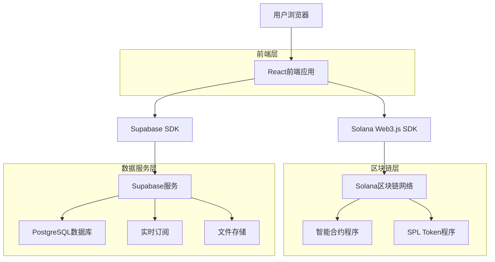
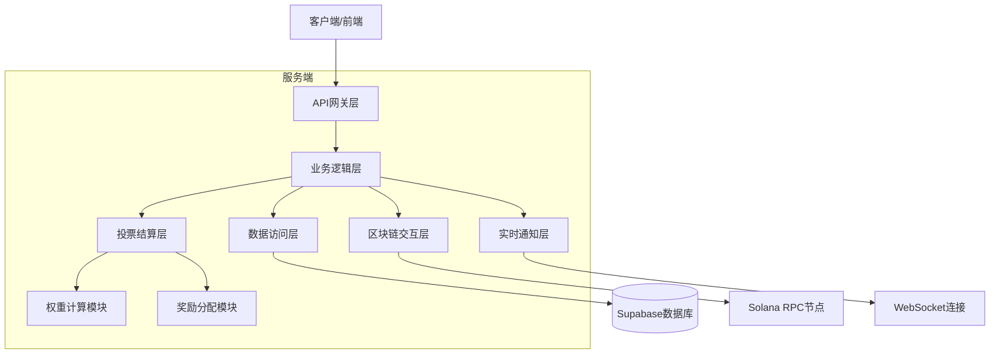
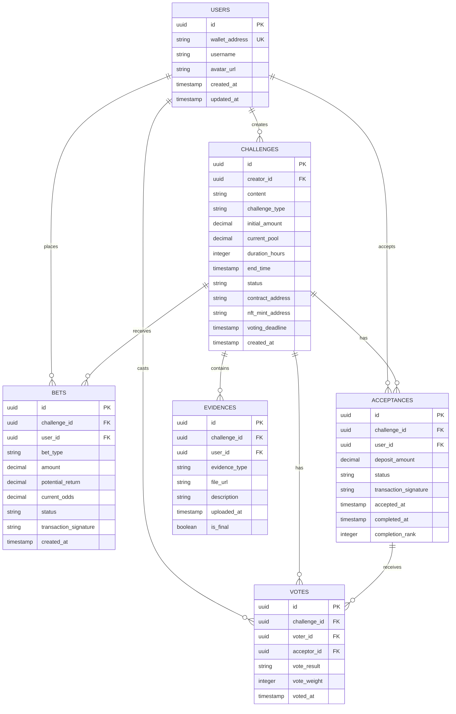

# Challenge Market 技术架构文档

## 1. 架构设计



## 2. 技术描述

* **前端**: React\@18 + TypeScript + Tailwind CSS\@3 + Vite

* **区块链**: Solana + Anchor框架 + @solana/web3.js + @solana/wallet-adapter

* **数据服务**: Supabase (PostgreSQL + 实时订阅 + 文件存储)

* **状态管理**: Zustand

* **UI组件**: Radix UI + Framer Motion

## 3. 路由定义

| 路由             | 用途                  |
| -------------- | ------------------- |
| /              | 首页，展示热门挑战和实时排行榜     |
| /create        | 挑战创建页，发起新挑战         |
| /challenge/:id | 挑战详情页，显示具体挑战信息和下注界面 |
| /profile       | 个人中心，用户的挑战记录和收益统计   |
| /wallet        | 钱包连接页，SOL钱包连接和身份验证  |
| /result/:id    | 结算页面，显示挑战结果和奖励分配    |

## 4. API定义

### 4.1 核心API

**挑战相关接口**

```
GET /api/challenges
```

获取挑战列表

请求参数:

| 参数名    | 参数类型   | 是否必需  | 描述                                         |
| ------ | ------ | ----- | ------------------------------------------ |
| status | string | false | 挑战状态: active, completed, expired           |
| sort   | string | false | 排序方式: pool\_amount, created\_at, end\_time |
| limit  | number | false | 返回数量限制，默认20                                |

响应:

| 参数名        | 参数类型         | 描述   |
| ---------- | ------------ | ---- |
| challenges | Challenge\[] | 挑战列表 |
| total      | number       | 总数量  |

```
POST /api/challenges
```

创建新挑战

请求:

| 参数名             | 参数类型   | 是否必需  | 描述                 |
| --------------- | ------ | ----- | ------------------ |
| content         | string | true  | 挑战内容描述             |
| duration\_hours | number | false | 持续时间（小时，1-24）      |
| duration\_days  | number | false | 持续时间（天，1-7）        |
| initial\_amount | number | true  | 初始奖池金额（SOL）        |
| challenge\_type | string | true  | 挑战类型: self, public |

响应:

| 参数名               | 参数类型   | 描述        |
| ----------------- | ------ | --------- |
| challenge\_id     | string | 挑战ID      |
| contract\_address | string | 智能合约地址    |
| nft\_mint         | string | 挑战NFT铸造地址 |

**下注相关接口**

```
POST /api/bets
```

创建下注

请求:

| 参数名               | 参数类型   | 是否必需 | 描述                              |
| ----------------- | ------ | ---- | ------------------------------- |
| challenge\_id     | string | true | 挑战ID                            |
| bet\_type         | string | true | 下注类型: success, partial, failure |
| amount            | number | true | 下注金额（SOL）                       |
| wallet\_signature | string | true | 钱包签名                            |

响应:

| 参数名               | 参数类型   | 描述   |
| ----------------- | ------ | ---- |
| bet\_id           | string | 下注ID |
| potential\_return | number | 潜在收益 |
| current\_odds     | number | 当前赔率 |

**投票结算相关接口**

```
POST /api/votes
```

提交投票

请求:

| 参数名               | 参数类型   | 是否必需 | 描述                     |
| ----------------- | ------ | ---- | ---------------------- |
| challenge\_id     | string | true | 挑战ID                   |
| acceptor\_id      | string | true | 接受者ID                  |
| vote              | string | true | 投票结果: success, failure |
| wallet\_signature | string | true | 钱包签名验证                 |

响应:

| 参数名              | 参数类型   | 描述           |
| ---------------- | ------ | ------------ |
| vote\_id         | string | 投票ID         |
| current\_weight  | number | 当前权重统计       |
| voting\_deadline | string | 投票截止时间（6小时后） |

```
GET /api/challenges/:id/voting-status
```

获取投票状态

响应:

| 参数名            | 参数类型    | 描述            |
| -------------- | ------- | ------------- |
| voting\_active | boolean | 投票是否进行中       |
| deadline       | string  | 投票截止时间（6小时限制） |
| total\_weight  | number  | 总投票权重         |
| votes\_summary | object  | 各接受者投票统计      |

```
POST /api/challenges/:id/settle
```

执行结算

请求:

| 参数名             | 参数类型   | 是否必需 | 描述     |
| --------------- | ------ | ---- | ------ |
| voting\_results | object | true | 投票结果汇总 |

响应:

| 参数名                     | 参数类型   | 描述     |
| ----------------------- | ------ | ------ |
| settlement\_id          | string | 结算ID   |
| reward\_distribution    | object | 奖励分配详情 |
| transaction\_signatures | array  | 转账交易签名 |

示例请求:

```json
{
  "challenge_id": "ch_123456",
  "bet_type": "success",
  "amount": 0.5,
  "wallet_signature": "signature_string"
}
```

## 5. 服务器架构图



## 6. 数据模型

### 6.1 数据模型定义



### 6.2 数据定义语言

**用户表 (users)**

```sql
-- 创建用户表
CREATE TABLE users (
    id UUID PRIMARY KEY DEFAULT gen_random_uuid(),
    wallet_address VARCHAR(44) UNIQUE NOT NULL,
    username VARCHAR(50),
    avatar_url TEXT,
    total_earnings DECIMAL(10,4) DEFAULT 0,
    total_challenges INTEGER DEFAULT 0,
    created_at TIMESTAMP WITH TIME ZONE DEFAULT NOW(),
    updated_at TIMESTAMP WITH TIME ZONE DEFAULT NOW()
);

-- 创建索引
CREATE INDEX idx_users_wallet_address ON users(wallet_address);
CREATE INDEX idx_users_created_at ON users(created_at DESC);

-- 设置权限
GRANT SELECT ON users TO anon;
GRANT ALL PRIVILEGES ON users TO authenticated;
```

**挑战表 (challenges)**

```sql
-- 创建挑战表
CREATE TABLE challenges (
    id UUID PRIMARY KEY DEFAULT gen_random_uuid(),
    creator_id UUID REFERENCES users(id),
    content TEXT NOT NULL,
    challenge_type VARCHAR(20) DEFAULT 'public' CHECK (challenge_type IN ('self', 'public')),
    initial_amount DECIMAL(10,4) NOT NULL,
    current_pool DECIMAL(10,4) DEFAULT 0,
    duration_hours INTEGER NOT NULL CHECK (duration_hours IN (2, 6, 24)),
    end_time TIMESTAMP WITH TIME ZONE NOT NULL,
    status VARCHAR(20) DEFAULT 'active' CHECK (status IN ('active', 'accepted', 'completed', 'expired')),
    contract_address VARCHAR(44),
    nft_mint_address VARCHAR(44),
    result VARCHAR(20) CHECK (result IN ('success', 'partial', 'failure')),
    created_at TIMESTAMP WITH TIME ZONE DEFAULT NOW(),
    updated_at TIMESTAMP WITH TIME ZONE DEFAULT NOW()
);

-- 创建索引
CREATE INDEX idx_challenges_creator_id ON challenges(creator_id);
CREATE INDEX idx_challenges_status ON challenges(status);
CREATE INDEX idx_challenges_end_time ON challenges(end_time);
CREATE INDEX idx_challenges_current_pool ON challenges(current_pool DESC);

-- 设置权限
GRANT SELECT ON challenges TO anon;
GRANT ALL PRIVILEGES ON challenges TO authenticated;
```

**下注表 (bets)**

```sql
-- 创建下注表
CREATE TABLE bets (
    id UUID PRIMARY KEY DEFAULT gen_random_uuid(),
    challenge_id UUID REFERENCES challenges(id),
    user_id UUID REFERENCES users(id),
    bet_type VARCHAR(20) NOT NULL CHECK (bet_type IN ('success', 'partial', 'failure')),
    amount DECIMAL(10,4) NOT NULL,
    potential_return DECIMAL(10,4) NOT NULL,
    current_odds DECIMAL(8,2) NOT NULL,
    status VARCHAR(20) DEFAULT 'active' CHECK (status IN ('active', 'won', 'lost', 'refunded')),
    transaction_signature VARCHAR(88),
    created_at TIMESTAMP WITH TIME ZONE DEFAULT NOW()
);

-- 创建索引
CREATE INDEX idx_bets_challenge_id ON bets(challenge_id);
CREATE INDEX idx_bets_user_id ON bets(user_id);
CREATE INDEX idx_bets_status ON bets(status);

-- 设置权限
GRANT SELECT ON bets TO anon;
GRANT ALL PRIVILEGES ON bets TO authenticated;
```

**接受记录表 (acceptances)**

```sql
-- 创建接受记录表
CREATE TABLE acceptances (
    id UUID PRIMARY KEY DEFAULT gen_random_uuid(),
    challenge_id UUID REFERENCES challenges(id),
    user_id UUID REFERENCES users(id),
    deposit_amount DECIMAL(10,4) NOT NULL,
    status VARCHAR(20) DEFAULT 'active' CHECK (status IN ('active', 'completed', 'failed')),
    transaction_signature VARCHAR(88),
    accepted_at TIMESTAMP WITH TIME ZONE DEFAULT NOW()
);

-- 创建索引
CREATE INDEX idx_acceptances_challenge_id ON acceptances(challenge_id);
CREATE INDEX idx_acceptances_user_id ON acceptances(user_id);

-- 设置权限
GRANT SELECT ON acceptances TO anon;
GRANT ALL PRIVILEGES ON acceptances TO authenticated;
```

**证据表 (evidences)**

```sql
-- 创建证据表
CREATE TABLE evidences (
    id UUID PRIMARY KEY DEFAULT gen_random_uuid(),
    challenge_id UUID REFERENCES challenges(id),
    user_id UUID REFERENCES users(id),
    evidence_type VARCHAR(20) NOT NULL CHECK (evidence_type IN ('image', 'video', 'text')),
    file_url TEXT,
    description TEXT,
    uploaded_at TIMESTAMP WITH TIME ZONE DEFAULT NOW(),
    is_final BOOLEAN DEFAULT FALSE
);

-- 创建索引
CREATE INDEX idx_evidences_challenge_id ON evidences(challenge_id);
CREATE INDEX idx_evidences_user_id ON evidences(user_id);
CREATE INDEX idx_evidences_uploaded_at ON evidences(uploaded_at DESC);

-- 设置权限
GRANT SELECT ON evidences TO anon;
GRANT ALL PRIVILEGES ON evidences TO authenticated;
```

**投票表 (votes)**

```sql
-- 创建投票表
CREATE TABLE votes (
    id UUID PRIMARY KEY DEFAULT gen_random_uuid(),
    challenge_id UUID REFERENCES challenges(id),
    voter_id UUID REFERENCES users(id),
    acceptor_id UUID REFERENCES acceptances(id),
    vote_result VARCHAR(20) NOT NULL CHECK (vote_result IN ('success', 'failure')),
    vote_weight INTEGER NOT NULL DEFAULT 1,
    voted_at TIMESTAMP WITH TIME ZONE DEFAULT NOW(),
    UNIQUE(challenge_id, voter_id, acceptor_id)
);

-- 创建索引
CREATE INDEX idx_votes_challenge_id ON votes(challenge_id);
CREATE INDEX idx_votes_voter_id ON votes(voter_id);
CREATE INDEX idx_votes_acceptor_id ON votes(acceptor_id);

-- 设置权限
GRANT SELECT ON votes TO anon;
GRANT ALL PRIVILEGES ON votes TO authenticated;
```

**初始化数据**

```sql
-- 插入示例挑战数据
INSERT INTO challenges (creator_id, content, challenge_type, initial_amount, current_pool, duration_hours, end_time, voting_deadline, contract_address)
VALUES 
    ((SELECT id FROM users LIMIT 1), '我赌你能在2小时内跑完5公里', 'public', 0.1, 0.1, 2, NOW() + INTERVAL '2 hours', NOW() + INTERVAL '26 hours', 'contract_address_1'),
    ((SELECT id FROM users LIMIT 1), '谁敢在24小时内写一首歌上传到链上？', 'public', 0.05, 0.05, 24, NOW() + INTERVAL '24 hours', NOW() + INTERVAL '48 hours', 'contract_address_2');
```

