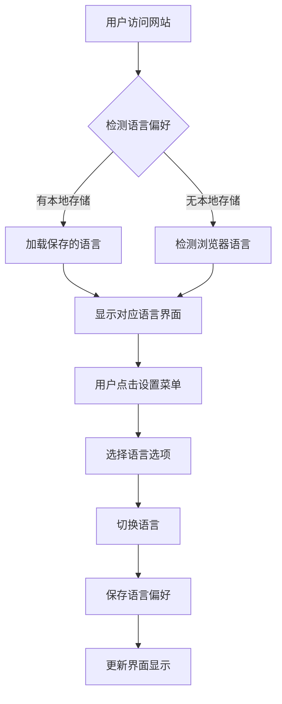

# Challenge Market 国际化功能需求文档

## 1. 产品概述

为 Challenge Market 挑战市场平台添加国际化支持，实现中英文双语切换功能，提升用户体验和产品的全球化适用性。该功能将支持语言偏好持久化存储，自动检测浏览器语言，并提供便捷的语言切换界面。

## 2. 核心功能

### 2.1 用户角色
所有用户角色均可使用语言切换功能，无需额外权限。

### 2.2 功能模块

国际化功能包含以下核心模块：
1. **语言切换界面**：在导航栏设置菜单中添加语言选择选项
2. **文案翻译系统**：支持所有界面文案的中英文切换
3. **语言持久化**：保存用户语言偏好到本地存储
4. **自动语言检测**：根据浏览器语言自动设置默认语言

### 2.3 页面详情

| 页面名称 | 模块名称 | 功能描述 |
|---------|---------|---------|
| 导航栏 | 语言切换菜单 | 在设置下拉菜单中添加语言选择项，显示当前语言状态，支持中英文切换 |
| 首页 | 多语言内容显示 | 翻译页面标题、标签页、搜索框占位符、挑战卡片内容等所有文案 |
| 挑战详情页 | 详情内容翻译 | 翻译挑战描述、参与按钮、状态标签、评论区等内容 |
| 创建挑战页 | 表单翻译 | 翻译表单标签、占位符、验证提示、按钮文案等 |
| 个人资料页 | 用户信息翻译 | 翻译用户统计、设置选项、钱包信息等内容 |
| 结算页面 | 投票界面翻译 | 翻译投票选项、结果显示、奖励信息等内容 |

## 3. 核心流程

### 用户语言切换流程：
1. 用户访问网站 → 系统检测浏览器语言或读取本地存储的语言偏好
2. 用户点击导航栏设置按钮 → 显示设置菜单
3. 用户选择"语言设置" → 显示语言选择选项（中文/English）
4. 用户选择目标语言 → 系统切换界面语言并保存偏好
5. 页面内容实时更新为选择的语言

## 4. 用户界面设计

### 4.1 设计风格
- **语言切换按钮**：集成在现有设置菜单中，保持界面简洁
- **语言标识**：使用语言名称显示（中文/English），避免使用国旗图标
- **切换动画**：平滑的文案切换效果，无页面刷新
- **状态指示**：当前选中语言高亮显示

### 4.2 页面设计概览

| 页面名称 | 模块名称 | UI元素 |
|---------|---------|--------|
| 导航栏 | 语言切换菜单 | 下拉菜单项，当前语言标识，切换选项按钮 |
| 所有页面 | 文案显示 | 动态文案渲染，支持参数插值，保持原有样式和布局 |

### 4.3 响应式设计
- 移动端和桌面端均支持语言切换功能
- 语言切换菜单在移动端保持易用性
- 文案长度变化时自动调整布局

## 5. 技术要求

### 5.1 翻译覆盖范围
- **静态文案**：所有界面标签、按钮、提示文字
- **动态内容**：错误消息、成功提示、表单验证信息
- **数据内容**：挑战标题、描述等用户生成内容的多语言支持
- **时间格式**：日期时间显示的本地化格式

### 5.2 翻译质量要求
- 准确性：确保翻译准确传达原意
- 一致性：术语翻译保持一致
- 简洁性：符合目标语言的表达习惯
- 上下文适配：根据使用场景选择合适的翻译

### 5.3 性能要求
- 语言切换响应时间 < 200ms
- 首次加载不影响页面性能
- 翻译资源按需加载
- 支持翻译资源缓存