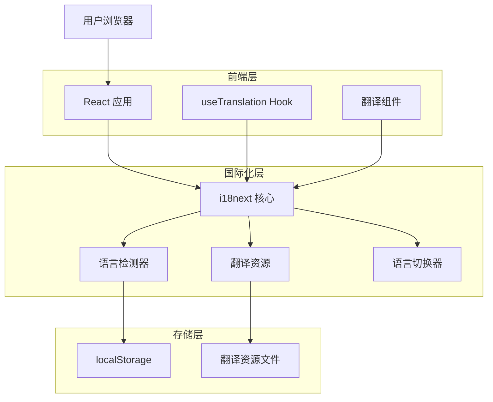

# Challenge Market 国际化技术架构文档

## 1. 架构设计



## 2. 技术描述

- 前端：React@18 + react-i18next@13 + i18next@23 + i18next-browser-languagedetector@7
- 状态管理：i18next 内置状态管理
- 存储：localStorage + 浏览器语言检测
- 构建工具：Vite（支持动态导入翻译资源）

## 3. 路由定义

国际化功能不影响现有路由结构，所有路由保持不变：

| 路由 | 用途 |
|------|------|
| /home | 首页，支持多语言显示 |
| /create | 创建挑战页，表单和提示支持多语言 |
| /challenge/:id | 挑战详情页，内容支持多语言 |
| /profile | 个人资料页，界面支持多语言 |
| /settlement/:id | 结算页面，投票界面支持多语言 |

## 4. 国际化配置

### 4.1 核心配置

i18n 初始化配置：
```typescript
// src/lib/i18n.ts
import i18n from 'i18next';
import { initReactI18next } from 'react-i18next';
import LanguageDetector from 'i18next-browser-languagedetector';

// 翻译资源
import zhCommon from '../locales/zh/common.json';
import enCommon from '../locales/en/common.json';
import zhHome from '../locales/zh/home.json';
import enHome from '../locales/en/home.json';

const resources = {
  zh: {
    common: zhCommon,
    home: zhHome,
  },
  en: {
    common: enCommon,
    home: enHome,
  },
};

i18n
  .use(LanguageDetector)
  .use(initReactI18next)
  .init({
    resources,
    fallbackLng: 'zh',
    debug: process.env.NODE_ENV === 'development',
    
    detection: {
      order: ['localStorage', 'navigator', 'htmlTag'],
      caches: ['localStorage'],
    },
    
    interpolation: {
      escapeValue: false,
    },
  });

export default i18n;
```

### 4.2 翻译资源结构

```typescript
// 翻译键值结构示例
interface TranslationKeys {
  common: {
    navbar: {
      home: string;
      create: string;
      profile: string;
      settings: string;
      language: string;
      theme: string;
      logout: string;
    };
    buttons: {
      confirm: string;
      cancel: string;
      save: string;
      delete: string;
      edit: string;
    };
    messages: {
      success: string;
      error: string;
      loading: string;
    };
  };
  home: {
    title: string;
    tabs: {
      hot: string;
      new: string;
      ending: string;
    };
    search: {
      placeholder: string;
      filter: string;
    };
    challenge: {
      participants: string;
      reward: string;
      timeLeft: string;
      participate: string;
    };
  };
}
```

## 5. 组件集成方案

### 5.1 Hook 使用模式

```typescript
// 在组件中使用翻译
import { useTranslation } from 'react-i18next';

function Navbar() {
  const { t, i18n } = useTranslation('common');
  
  const changeLanguage = (lng: string) => {
    i18n.changeLanguage(lng);
  };
  
  return (
    <nav>
      <span>{t('navbar.home')}</span>
      <button onClick={() => changeLanguage('en')}>
        {t('navbar.language')}
      </button>
    </nav>
  );
}
```

### 5.2 语言切换组件

```typescript
// 语言切换器组件
interface LanguageSwitcherProps {
  className?: string;
}

function LanguageSwitcher({ className }: LanguageSwitcherProps) {
  const { i18n, t } = useTranslation('common');
  
  const languages = [
    { code: 'zh', name: '中文' },
    { code: 'en', name: 'English' },
  ];
  
  return (
    <DropdownMenu>
      <DropdownMenuTrigger className={className}>
        {t('navbar.language')}
      </DropdownMenuTrigger>
      <DropdownMenuContent>
        {languages.map((lang) => (
          <DropdownMenuItem
            key={lang.code}
            onClick={() => i18n.changeLanguage(lang.code)}
            className={i18n.language === lang.code ? 'bg-accent' : ''}
          >
            {lang.name}
          </DropdownMenuItem>
        ))}
      </DropdownMenuContent>
    </DropdownMenu>
  );
}
```

## 6. 翻译资源管理

### 6.1 文件结构

```
src/
├── locales/
│   ├── zh/
│   │   ├── common.json      # 通用翻译（导航、按钮等）
│   │   ├── home.json        # 首页翻译
│   │   ├── challenge.json   # 挑战相关翻译
│   │   ├── profile.json     # 个人资料翻译
│   │   └── errors.json      # 错误信息翻译
│   └── en/
│       ├── common.json
│       ├── home.json
│       ├── challenge.json
│       ├── profile.json
│       └── errors.json
└── lib/
    └── i18n.ts             # i18n 配置文件
```

### 6.2 翻译资源示例

中文资源 (zh/common.json)：
```json
{
  "navbar": {
    "home": "首页",
    "create": "创建",
    "profile": "我的",
    "settings": "设置",
    "language": "语言",
    "theme": "主题",
    "logout": "退出登录"
  },
  "buttons": {
    "confirm": "确认",
    "cancel": "取消",
    "save": "保存",
    "delete": "删除",
    "edit": "编辑"
  },
  "wallet": {
    "connect": "连接钱包",
    "disconnect": "断开连接",
    "balance": "余额",
    "address": "地址"
  }
}
```

英文资源 (en/common.json)：
```json
{
  "navbar": {
    "home": "Home",
    "create": "Create",
    "profile": "Profile",
    "settings": "Settings",
    "language": "Language",
    "theme": "Theme",
    "logout": "Logout"
  },
  "buttons": {
    "confirm": "Confirm",
    "cancel": "Cancel",
    "save": "Save",
    "delete": "Delete",
    "edit": "Edit"
  },
  "wallet": {
    "connect": "Connect Wallet",
    "disconnect": "Disconnect",
    "balance": "Balance",
    "address": "Address"
  }
}
```

## 7. 实施计划

### 7.1 第一阶段：基础设施搭建
1. 安装 i18next 相关依赖包
2. 创建 i18n 配置文件
3. 设置翻译资源文件结构
4. 在 main.tsx 中集成 i18n

### 7.2 第二阶段：核心组件翻译
1. 翻译 Navbar 导航栏组件
2. 实现语言切换 UI 组件
3. 翻译 Home 首页组件
4. 翻译钱包相关组件

### 7.3 第三阶段：页面组件翻译
1. 翻译 CreateChallenge 创建挑战页
2. 翻译 ChallengeDetail 挑战详情页
3. 翻译 Profile 个人资料页
4. 翻译 Settlement 结算页面

### 7.4 第四阶段：优化和测试
1. 添加错误信息和提示的翻译
2. 优化翻译资源加载性能
3. 测试语言切换功能
4. 修复翻译相关问题

## 8. 性能优化

### 8.1 资源加载优化
- 使用 Vite 的动态导入功能按需加载翻译资源
- 实现翻译资源的懒加载和缓存机制
- 压缩翻译 JSON 文件大小

### 8.2 运行时优化
- 避免不必要的重新渲染
- 使用 React.memo 优化翻译组件
- 缓存翻译结果减少计算开销

### 8.3 构建优化
- 在构建时验证翻译键的完整性
- 自动检测未使用的翻译键
- 生成翻译覆盖率报告