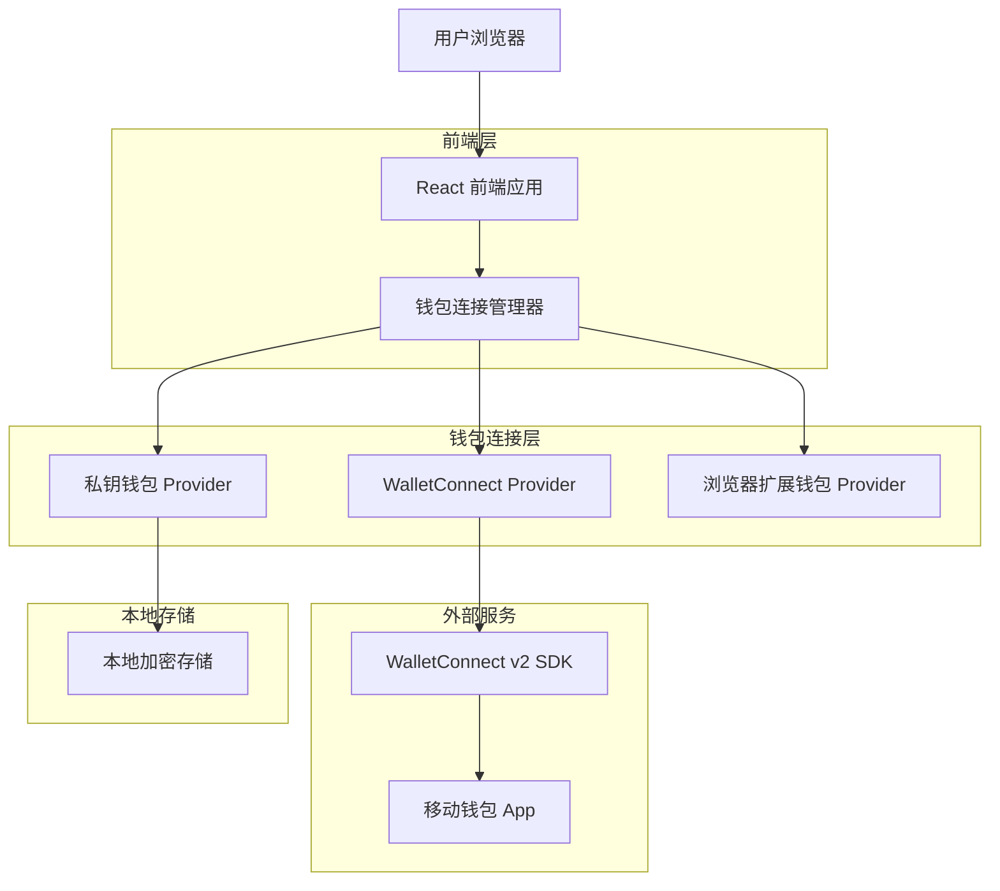
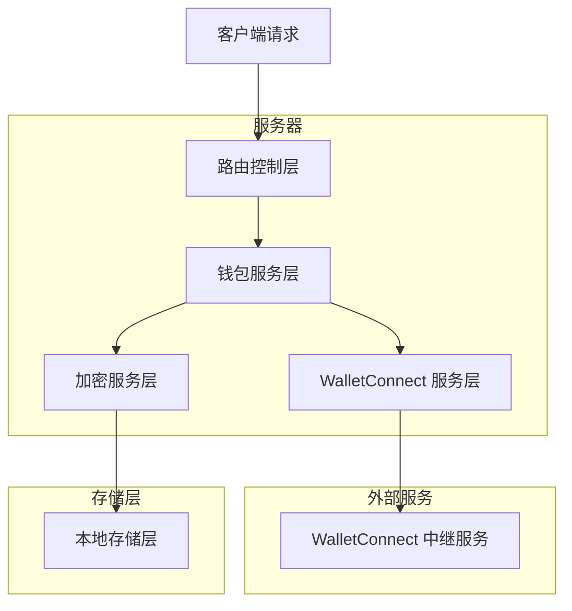
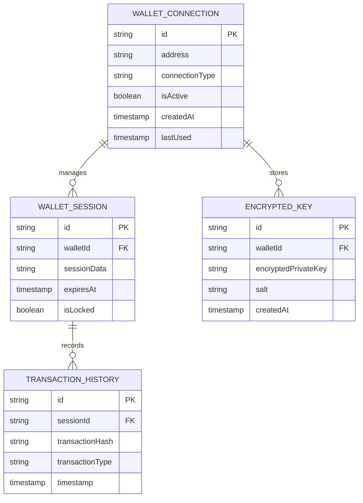

# Challenge Market 移动端钱包技术架构文档

## 1. 架构设计



## 2. 技术描述

* 前端：React\@18 + TypeScript + Vite + TailwindCSS

* 钱包连接：@walletconnect/web3wallet + @solana/web3.js

* 加密存储：crypto-js + browser localStorage

* 二维码：qrcode + qrcode-reader

* UI 组件：shadcn/ui + lucide-react

## 3. 路由定义

| 路由               | 用途                    |
| ---------------- | --------------------- |
| /wallet/connect  | 钱包连接页面，支持多种连接方式选择     |
| /wallet/qr       | WalletConnect 二维码连接页面 |
| /wallet/import   | 私钥导入页面                |
| /wallet/manage   | 钱包管理页面，显示连接状态和设置      |
| /wallet/security | 钱包安全设置页面              |

## 4. API 定义

### 4.1 钱包连接 API

**WalletConnect 连接初始化**

```
POST /api/wallet/walletconnect/init
```

请求：

| 参数名称      | 参数类型   | 是否必需 | 描述                          |
| --------- | ------ | ---- | --------------------------- |
| chainId   | string | true | Solana 链 ID (solana:devnet) |
| projectId | string | true | WalletConnect 项目 ID         |

响应：

| 参数名称   | 参数类型   | 描述                   |
| ------ | ------ | -------------------- |
| uri    | string | WalletConnect 连接 URI |
| qrCode | string | Base64 编码的二维码图片      |

示例：

```json
{
  "uri": "wc:abc123@2?relay-protocol=irn&symKey=def456",
  "qrCode": "data:image/png;base64,iVBORw0KGgoAAAANSUhEUgAA..."
}
```

**私钥导入验证**

```
POST /api/wallet/import/validate
```

请求：

| 参数名称       | 参数类型   | 是否必需 | 描述           |
| ---------- | ------ | ---- | ------------ |
| privateKey | string | true | Base58 编码的私钥 |
| password   | string | true | 钱包保护密码       |

响应：

| 参数名称         | 参数类型    | 描述      |
| ------------ | ------- | ------- |
| isValid      | boolean | 私钥是否有效  |
| publicKey    | string  | 对应的公钥地址 |
| encryptedKey | string  | 加密后的私钥  |

示例：

```json
{
  "isValid": true,
  "publicKey": "9WzDXwBbmkg8ZTbNMqUxvQRAyrZzDsGYdLVL9zYtAWWM",
  "encryptedKey": "U2FsdGVkX1+vupppZksvRf5pq5g5XjFRIipRkwB0K1Y="
}
```

### 4.2 钱包管理 API

**获取钱包信息**

```
GET /api/wallet/info
```

响应：

| 参数名称           | 参数类型    | 描述                                      |
| -------------- | ------- | --------------------------------------- |
| address        | string  | 钱包地址                                    |
| balance        | number  | SOL 余额                                  |
| connectionType | string  | 连接类型 (extension/walletconnect/imported) |
| isLocked       | boolean | 是否已锁定                                   |

**钱包锁定/解锁**

```
POST /api/wallet/lock
```

请求：

| 参数名称     | 参数类型   | 是否必需  | 描述                 |
| -------- | ------ | ----- | ------------------ |
| action   | string | true  | 操作类型 (lock/unlock) |
| password | string | false | 解锁时需要的密码           |

## 5. 服务器架构图



## 6. 数据模型

### 6.1 数据模型定义



### 6.2 数据定义语言

**钱包连接表 (wallet\_connections)**

```sql
-- 创建表
CREATE TABLE wallet_connections (
    id UUID PRIMARY KEY DEFAULT gen_random_uuid(),
    address VARCHAR(44) UNIQUE NOT NULL,
    connection_type VARCHAR(20) NOT NULL CHECK (connection_type IN ('extension', 'walletconnect', 'imported')),
    is_active BOOLEAN DEFAULT true,
    created_at TIMESTAMP WITH TIME ZONE DEFAULT NOW(),
    last_used TIMESTAMP WITH TIME ZONE DEFAULT NOW()
);

-- 创建索引
CREATE INDEX idx_wallet_connections_address ON wallet_connections(address);
CREATE INDEX idx_wallet_connections_type ON wallet_connections(connection_type);
CREATE INDEX idx_wallet_connections_active ON wallet_connections(is_active);

-- 初始数据
INSERT INTO wallet_connections (address, connection_type) VALUES
('9WzDXwBbmkg8ZTbNMqUxvQRAyrZzDsGYdLVL9zYtAWWM', 'extension'),
('7xKXtg2CW87d97TXJSDpbD5jBkheTqA83TZRuJosgAsU', 'walletconnect');
```

**钱包会话表 (wallet\_sessions)**

```sql
-- 创建表
CREATE TABLE wallet_sessions (
    id UUID PRIMARY KEY DEFAULT gen_random_uuid(),
    wallet_id UUID REFERENCES wallet_connections(id) ON DELETE CASCADE,
    session_data TEXT,
    expires_at TIMESTAMP WITH TIME ZONE NOT NULL,
    is_locked BOOLEAN DEFAULT false,
    created_at TIMESTAMP WITH TIME ZONE DEFAULT NOW()
);

-- 创建索引
CREATE INDEX idx_wallet_sessions_wallet_id ON wallet_sessions(wallet_id);
CREATE INDEX idx_wallet_sessions_expires_at ON wallet_sessions(expires_at);
CREATE INDEX idx_wallet_sessions_locked ON wallet_sessions(is_locked);
```

**加密密钥表 (encrypted\_keys)**

```sql
-- 创建表
CREATE TABLE encrypted_keys (
    id UUID PRIMARY KEY DEFAULT gen_random_uuid(),
    wallet_id UUID REFERENCES wallet_connections(id) ON DELETE CASCADE,
    encrypted_private_key TEXT NOT NULL,
    salt VARCHAR(32) NOT NULL,
    created_at TIMESTAMP WITH TIME ZONE DEFAULT NOW()
);

-- 创建索引
CREATE INDEX idx_encrypted_keys_wallet_id ON encrypted_keys(wallet_id);

-- 权限设置
GRANT SELECT, INSERT, UPDATE ON wallet_connections TO authenticated;
GRANT SELECT, INSERT, UPDATE, DELETE ON wallet_sessions TO authenticated;
GRANT SELECT, INSERT, DELETE ON encrypted_keys TO authenticated;
GRANT SELECT ON wallet_connections TO anon;
```

**交易历史表 (transaction\_history)**

```sql
-- 创建表
CREATE TABLE transaction_history (
    id UUID PRIMARY KEY DEFAULT gen_random_uuid(),
    session_id UUID REFERENCES wallet_sessions(id) ON DELETE CASCADE,
    transaction_hash VARCHAR(88) NOT NULL,
    transaction_type VARCHAR(50) NOT NULL,
    amount DECIMAL(20, 9),
    status VARCHAR(20) DEFAULT 'pending',
    timestamp TIMESTAMP WITH TIME ZONE DEFAULT NOW()
);

-- 创建索引
CREATE INDEX idx_transaction_history_session_id ON transaction_history(session_id);
CREATE INDEX idx_transaction_history_hash ON transaction_history(transaction_hash);
CREATE INDEX idx_transaction_history_timestamp ON transaction_history(timestamp DESC);
```

