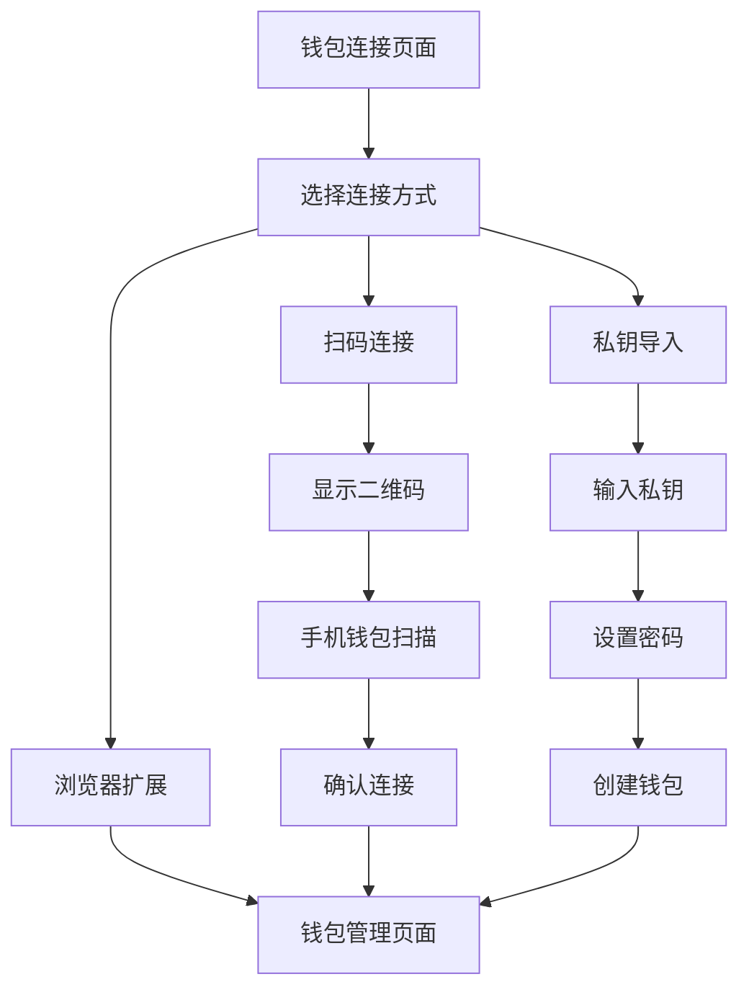

# Challenge Market 移动端钱包支持功能需求文档

## 1. 产品概述

为 Challenge Market 挑战赛平台添加移动端钱包支持，通过 WalletConnect 协议实现手机钱包扫码登录，并提供私钥导入功能，让用户可以更便捷地使用移动设备参与挑战赛活动。

- 解决用户在移动设备上无法连接钱包的问题
- 提供多种钱包连接方式，提升用户体验和平台可访问性

## 2. 核心功能

### 2.1 用户角色
| 角色 | 注册方式 | 核心权限 |
|------|----------|----------|
| 移动端用户 | WalletConnect 扫码连接 | 可使用手机钱包参与所有挑战赛功能 |
| 私钥导入用户 | 私钥导入创建钱包 | 可使用导入的钱包参与所有功能 |
| 传统用户 | 浏览器扩展钱包 | 保持现有功能不变 |

### 2.2 功能模块

我们的移动端钱包支持需求包含以下主要功能：

1. **WalletConnect 扫码登录**：二维码生成、扫码连接、会话管理
2. **私钥导入登录**：私钥输入、钱包创建、安全存储
3. **钱包管理界面**：连接状态显示、切换钱包、断开连接
4. **安全设置**：钱包锁定、密码保护、安全提示

### 2.3 页面详情

| 页面名称 | 模块名称 | 功能描述 |
|----------|----------|----------|
| 钱包连接页面 | WalletConnect 模块 | 显示二维码，支持手机钱包扫码连接。包含连接状态、错误处理、重新生成二维码 |
| 钱包连接页面 | 私钥导入模块 | 提供私钥输入框，创建本地钱包。包含格式验证、安全警告、加密存储 |
| 钱包连接页面 | 连接方式选择 | 显示多种连接选项：浏览器扩展、扫码连接、私钥导入。包含选项卡切换、使用指引 |
| 钱包管理页面 | 钱包信息显示 | 显示当前连接的钱包信息、余额、地址。包含复制地址、查看详情、安全设置 |
| 钱包管理页面 | 安全设置 | 提供钱包锁定、密码设置、私钥导出功能。包含安全验证、操作确认、风险提示 |

## 3. 核心流程

### 用户操作流程

**WalletConnect 扫码连接流程：**
1. 用户点击"扫码连接"选项
2. 系统生成 WalletConnect URI 和二维码
3. 用户使用手机钱包扫描二维码
4. 手机钱包确认连接请求
5. 系统建立连接会话，用户成功登录

**私钥导入连接流程：**
1. 用户点击"导入私钥"选项
2. 系统显示私钥输入界面和安全警告
3. 用户输入私钥并设置钱包密码
4. 系统验证私钥格式并创建本地钱包
5. 私钥加密存储，用户成功登录

## 4. 用户界面设计

### 4.1 设计风格
- 主色调：蓝色系 (#3B82F6) 和绿色系 (#10B981)
- 按钮样式：圆角按钮，支持悬停效果
- 字体：系统默认字体，标题 18px，正文 14px
- 布局风格：卡片式布局，响应式设计
- 图标风格：线性图标，配合二维码和钱包相关图标

### 4.2 页面设计概览

| 页面名称 | 模块名称 | UI 元素 |
|----------|----------|---------|
| 钱包连接页面 | 连接方式选择 | 选项卡导航，图标按钮，简洁布局，蓝色主题色 |
| 钱包连接页面 | WalletConnect 模块 | 二维码显示区域，连接状态指示器，刷新按钮，加载动画 |
| 钱包连接页面 | 私钥导入模块 | 私钥输入框，密码输入框，安全警告提示，确认按钮 |
| 钱包管理页面 | 钱包信息 | 钱包地址显示，余额卡片，复制按钮，绿色成功状态 |
| 钱包管理页面 | 安全设置 | 设置选项列表，开关按钮，危险操作红色警告 |

### 4.3 响应式设计
桌面优先设计，移动端自适应。支持触摸交互优化，二维码在移动端自动调整大小，私钥输入支持移动端键盘优化。

## 5. 技术实现要求

### 5.1 WalletConnect 集成
- 使用 WalletConnect v2 协议
- 支持 Solana 链的钱包连接
- 实现会话管理和自动重连
- 处理连接超时和错误状态

### 5.2 私钥管理
- 使用 AES 加密算法加密私钥
- 本地安全存储，不上传服务器
- 支持密码保护和钱包锁定
- 提供私钥导出和备份功能

### 5.3 安全考虑
- 私钥输入时显示安全警告
- 实现钱包自动锁定机制
- 提供安全最佳实践指导
- 支持会话超时自动断开

### 5.4 兼容性要求
- 兼容现有的浏览器扩展钱包
- 支持主流移动钱包 App
- 保持现有功能不受影响
- 提供平滑的用户体验过渡